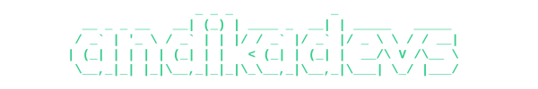

<!-- @format -->

 

 

## 🛠️ Ability toolkit

Disclaimer: I'm not an Assembly guy :> Here is a list of all the tools that help me complete all my projects!

#### Programming Language

    
    
    
    
    
    
    
    

#### Tools & Framework

    
    
    
    
    
    
    
    
    
    
    
    
    
    
    
    
    
    
    

#### Databases & Baas ( Backend as a Services )

    
    
    
    
    
    
    

#### DevOps

    
    
    
    
    
    
    

#### Design

    
    
    

## Portfolio

I'm a fighter who will do everything to become the best version of myself! I'm always eager to learn and level up my skills. Here is my portfolio, the place where I deliver my all ideas and inovations. You'll see innovative solutions and a bunch of web projects here!

[My Portfolio](https://andikads.vercel.app)

 

    

 
 

    

 
 

